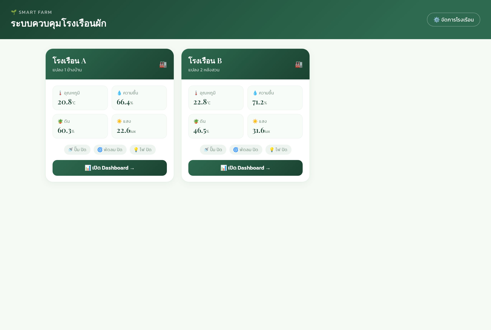
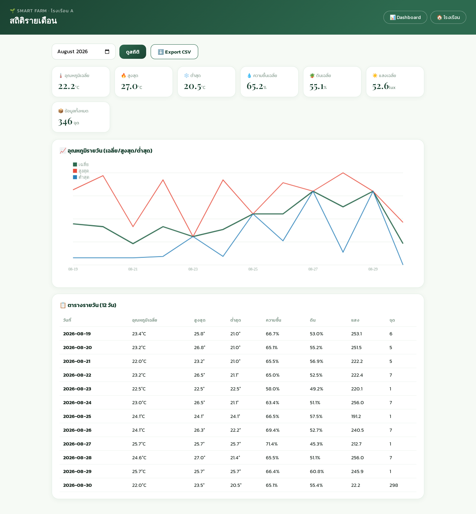
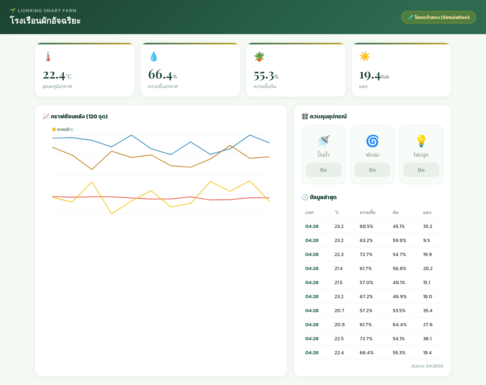
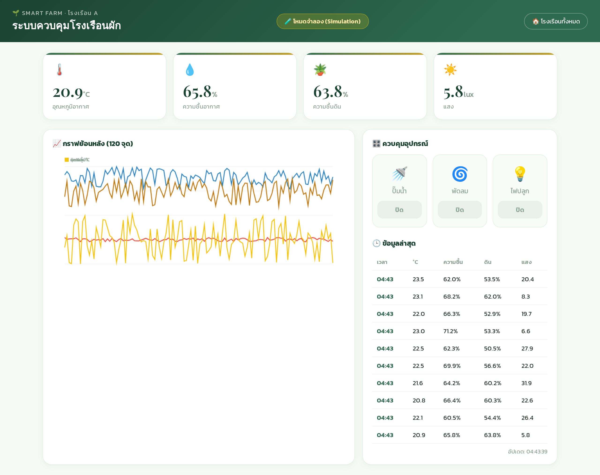

# Smart Farm 🌱 — ระบบควบคุมโรงเรือนผักอัจฉริยะ (POC)

ระบบควบคุมโรงเรือนผัก: ดูค่าอุณหภูมิ/ความชื้น/ดิน/แสงสด + ควบคุมปั๊มน้ำ/พัดลม/ไฟ จากเว็บ
รับข้อมูลจาก ESP32 (DHT22 + เซ็นเซอร์ความชื้นดิน + LDR) ผ่าน REST API

URL: https://smartfarm.oiy0982435serq4.win (Cloudflare tunnel)

## 🏭 รองรับหลายโรงเรือน (Multi-Site)
- หน้า `/` = รายการโรงเรือนทั้งหมด (การ์ดแต่ละโรงเรือน + ค่าสด + สถานะอุปกรณ์)
- `/site/<id>` = Dashboard ของแต่ละโรงเรือน (เซ็นเซอร์/กราฟ/ควบคุมแยกกัน)
- `/admin` = จัดการโรงเรือน (เพิ่ม/ลบ)
- API รองรับ `site` (`POST /api/sensor {"site":1,...}`, `GET /api/control?site=2`)

## 📊 สถิติรายเดือน
- `/site/<id>/stats` = เลือกเดือน → การ์ดสรุป (เฉลี่ย/สูงสุด/ต่ำสุด) + กราฟอุณหภูมิรายวัน + ตารางรายวัน
- `⬇️ Export CSV` (Thai BOM เปิด Excel ได้)
- `/api/stats?site=&month=` API ข้อมูลสถิติ

## ฟีเจอร์
- 📊 Dashboard สด — อุณหภูมิ/ความชื้นอากาศ/ความชื้นดิน/แสง + กราฟย้อนหลัง 120 จุด
- 🎛️ ควบคุมอุปกรณ์จากเว็บ — ปั๊มน้ำ 🚿 / พัดลม 🌀 / ไฟปลูก 💡 (ส่งคำสั่งให้ ESP32)
- 🧪 โหมดจำลอง (SIM=1) — สร้างข้อมูลเซ็นเซอร์เองทุกโรงเรือน เห็นภาพก่อนมีฮาร์ดแวร์
- 🔌 API สำหรับ ESP32:
  - `POST /api/sensor` — ส่งค่าจากเซ็นเซอร์ `{"temp","hum","soil","light"}` (+ `site`)
  - `GET /api/control` — ดึงสถานะอุปกรณ์ (`?site=`)
- 📅 บันทึกข้อมูล SQLite

## 📸 ตัวอย่างหน้าจอ








## รัน
```bash
pip install flask
DB_PATH=smartfarm.db PORT=5052 SIM=1 python app.py     # โหมดจำลอง
DB_PATH=smartfarm.db PORT=5052 SIM=0 python app.py     # รอข้อมูล ESP32 จริง
```

## API
| Method | Path | รายละเอียด |
|---|---|---|
| GET | `/` | Dashboard |
| POST | `/api/sensor` | ESP32 ส่งค่าเซ็นเซอร์ |
| GET | `/api/control` | ESP32 ดึงสถานะอุปกรณ์ |
| POST | `/api/control` | เปิด/ปิดอุปกรณ์ `{"pump":1,"fan":0,"light":1}` |
| GET | `/api/history` | ข้อมูลย้อนหลัง (กราฟ) |

## ฮาร์ดแวร์ (ESP32)
ดู `esp32/smartfarm.ino` — DHT22 (GPIO4), ความชื้นดิน (GPIO34), LDR (GPIO35),
Relay ปั๊ม/พัดลม/ไฟ (GPIO25/26/27) — ตั้งค่า SSID/รหัส/URL ในไฟล์ก่อนอัปโหลด

## โครงสร้าง
```
app.py                  # Flask server (Dashboard + API + SQLite + โหมดจำลอง)
templates/dashboard.html# UI
esp32/smartfarm.ino     # Firmware ESP32
```